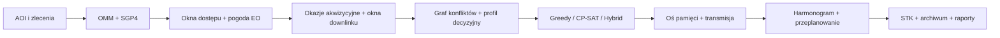

# Satellite Acquisition Planner

**Wersja:** `1.3.0`

Satellite Acquisition Planner służy do planowania akwizycji zobrazowań
satelitarnych SAR i EO. Aplikacja łączy publiczne dane orbitalne OMM,
propagację SGP4, okna dostępu, prognozę zachmurzenia, planowanie Greedy,
CP-SAT i Hybrid, przeplanowanie oraz walidację względem STK.

Wersja 1.3.0 rozszerza badawczy model planowania o stacje naziemne, jawne
okna downlinku i pamięć zmienną w czasie. Akwizycje zwiększają zajętość
pamięci, a zaplanowane transmisje zwalniają ją zgodnie z przepustowością
kontaktu. Zakres adaptacji oraz elementy autorskie opisano w
[`docs/research_foundations.md`](docs/research_foundations.md).

Scenariusz `POLAND_DEMO` zawiera kompletny zestaw danych offline do prezentacji
i testów regresyjnych. Wyniki mają charakter badawczy: nie potwierdzają
komercyjnego taskingu ani wykonania akwizycji przez operatora.

| Obszar | Stan projektu |
|---|---|
| Runtime referencyjny | Python 3.11 |
| Interfejs | Streamlit + Plotly + Folium |
| Planowanie | Greedy, Greedy 2.0, CP-SAT i Hybrid |
| Zasoby | pamięć dynamiczna, downlink i stacje naziemne |
| Jakość | Pytest, Ruff, audyt repozytorium, healthcheck i kontrola E2E |

## Najważniejsze funkcje

- profile 4 satelitów ICEYE i 2 satelitów Pléiades Neo;
- AOI typu Point, Polygon i Rectangle oraz import/eksport GeoJSON;
- OMM z CelesTrak, lokalny cache i propagacja SGP4;
- okna dostępu, ślady naziemne, globus operacyjny i mapa nieba;
- prognoza zachmurzenia Open-Meteo dla okazji EO;
- Greedy, Greedy 2.0, OR-Tools CP-SAT i planer Hybrid;
- stacje naziemne, okna downlinku, przepustowość i dynamiczna pamięć;
- graf konfliktów z diagnostyką komponentów i przyczyn;
- profile `BALANCED`, `EMERGENCY`, `QUALITY_FIRST`, `THROUGHPUT` i
  `SAR_EO_FUSION`;
- przeplanowanie z oknem zamrożonym i zakłóceniami operacyjnymi;
- benchmarki trzech metod, raporty naukowe i walidacja względem STK;
- przenośne archiwa `.satplan.zip` z kontrolą integralności SHA-256.

## Szybki start — Docker

```powershell
docker compose up --build --detach
docker compose ps
```

Aplikacja jest dostępna pod adresem `http://localhost:8501`. Kontener powinien
osiągnąć status `healthy`.

Można też użyć skryptu:

```powershell
.\scripts\start_satplan.ps1
```

## Instalacja lokalna na Windows

Projekt jest walidowany referencyjnie na Pythonie 3.11. `uv` ani Conda nie są
wymagane.

```powershell
py -3.11 -m venv .venv
Set-ExecutionPolicy -Scope Process -ExecutionPolicy Bypass
.\.venv\Scripts\Activate.ps1
python -m pip install --upgrade pip
python -m pip install -r .\requirements-dev.txt -c .\requirements-lock.txt
python -m streamlit run .\streamlit_app.py
```

## CLI

```powershell
python -m app.cli check
python -m app.cli paths
python -m app.cli plan --scenario POLAND_DEMO --algorithm HYBRID
python -m app.cli audit --strict
python -m app.cli health --skip-http
python -m app.cli release-check --algorithm ALL --cp-sat-time-limit 2
```

## Kontrola jakości

```powershell
.\scripts\verify_release.ps1
```

Pełna kontrola z czystym buildem obrazu:

```powershell
.\scripts\verify_release.ps1 -Docker -NoCache
```

Skrypt uruchamia testy, Ruff, audyt repozytorium, healthcheck oraz scenariusz
E2E. Produkcyjny obraz Docker nie zawiera Pytest ani Ruff; narzędzia
programistyczne są instalowane przez `requirements-dev.txt`.

## Przepływ danych



## Struktura repozytorium

| Warstwa | Pakiety i katalogi |
|---|---|
| Domena | `app/models`, `app/catalogs`, `app/geospatial` |
| Planowanie | `app/planning`, `app/services`, `app/scenarios` |
| Integracje i dane | `app/integrations`, `app/io`, `app/config` |
| Prezentacja | `app/ui`, `app/visualization`, `app/tracking`, `app/demo` |
| Analiza i wyniki | `app/analysis`, `app/projects`, `app/reporting`, `app/quality` |
| Utrzymanie | `scripts`, `tests`, `docs`, `data`, `examples` |

Szczegółowy opis: [`docs/project_structure.md`](docs/project_structure.md).

## Dokumentacja

- [indeks dokumentacji](docs/index.md),
- [instrukcja użytkownika](docs/user_guide.md),
- [model planowania](docs/planning_model.md),
- [podstawy badawcze wersji 1.3.0](docs/research_foundations.md),
- [downlink i pamięć dynamiczna](docs/downlink_and_dynamic_memory.md),
- [bibliografia i repozytoria referencyjne](docs/references.md),
- [metodyka naukowa](docs/scientific_methodology.md),
- [benchmarki](docs/benchmarking.md),
- [walidacja STK](docs/stk_validation.md),
- [ograniczenia modelu](docs/limitations.md),
- [informacje o wydaniu](RELEASE_NOTES.md).

## Podstawy naukowe

Wersja 1.3.0 jest autorską adaptacją metod opisanych w literaturze. Nie stanowi
kopii jednego artykułu ani repozytorium. Najważniejsze podstawy to:

- opportunity-based model i graf niewykonalności;
- korzyść oraz koszt utraconych okazji w heurystyce konstrukcyjnej;
- Greedy jako incumbent i lokalne podproblemy CP-SAT;
- wielokryterialne profile preferencji;
- reaktywne przeplanowanie po zakłóceniach;
- zintegrowane planowanie akwizycji, dynamicznej pamięci i downlinku.

Dokładne przypisanie źródło → moduł → zakres adaptacji znajduje się w
[`docs/research_foundations.md`](docs/research_foundations.md).

## Ograniczenia interpretacyjne

OMM/SGP4, geometria sensora, parametry manewrowe i budżety zasobów są jawnymi
założeniami modelu. Zachmurzenie wpływa na EO, lecz nie na SAR. Hybrid
zachowuje własny plan początkowy Greedy 2.0 przy równym statusie
wykonalności, ale nie gwarantuje optimum globalnego. Okna stacji naziemnych
w scenariuszach demonstracyjnych są syntetyczne i nie potwierdzają
operacyjnego dostępu do infrastruktury. STK
służy do walidacji zewnętrznej i nie jest wymagany do działania aplikacji.

## Wersjonowanie

Wersja aplikacji znajduje się w [`VERSION`](VERSION), a historia zmian w
[`CHANGELOG.md`](CHANGELOG.md).
