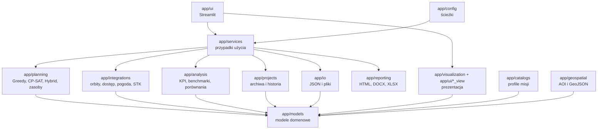
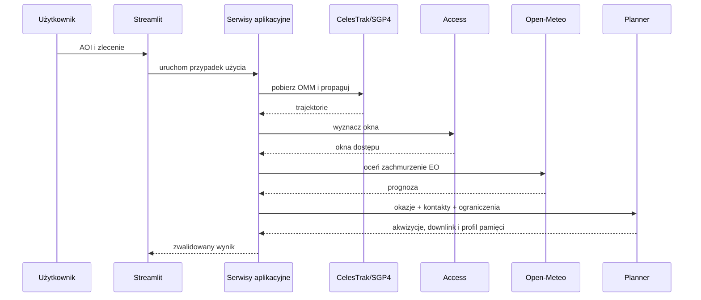
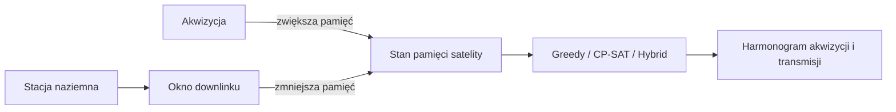

# Architektura systemu

## Warstwy i główne zależności

## Zasady zależności

- modele domenowe nie zależą od Streamlit;
- algorytmy planowania nie importują warstwy UI;
- serwisy koordynują przypadki użycia, integracje i planery;
- integracje zewnętrzne są izolowane w `app/integrations`;
- UI nie implementuje solverów ani ograniczeń optymalizacyjnych;
- strony UI mogą korzystać z modeli domenowych, typów wynikowych i czystych
  funkcji prezentacyjnych, natomiast operacje sieciowe i orkiestracja planowania
  powinny przechodzić przez serwisy;
- dane generowane trafiają do `data/generated`, a nie do katalogów wejściowych;
- raportowanie i archiwizacja operują na zwalidowanych snapshotach.

## Przepływ publiczny

## Przepływ zasobów danych

Modele `GroundStation`, `DownlinkOpportunity` i `DownlinkOpportunitySet` należą
do warstwy domenowej. `app/planning/resources.py` buduje profil pamięci i wpisy
transmisji, natomiast planery decydują o akwizycjach oraz — w trybie
zintegrowanym — o wykorzystaniu kontaktów. Dane scenariuszy demonstracyjnych są
syntetyczne i służą walidacji logiki, a nie geometrii radiowej.

## Renderowanie globusa

Aktywny renderer używa Plotly. Poprzedni prototyp Cesium został usunięty wraz
z nieużywanymi zasobami i testami. Strona `Globus operacyjny` korzysta wyłącznie
z bieżącej warstwy `app.visualization.plotly_globe`.
