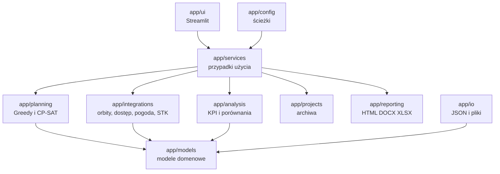
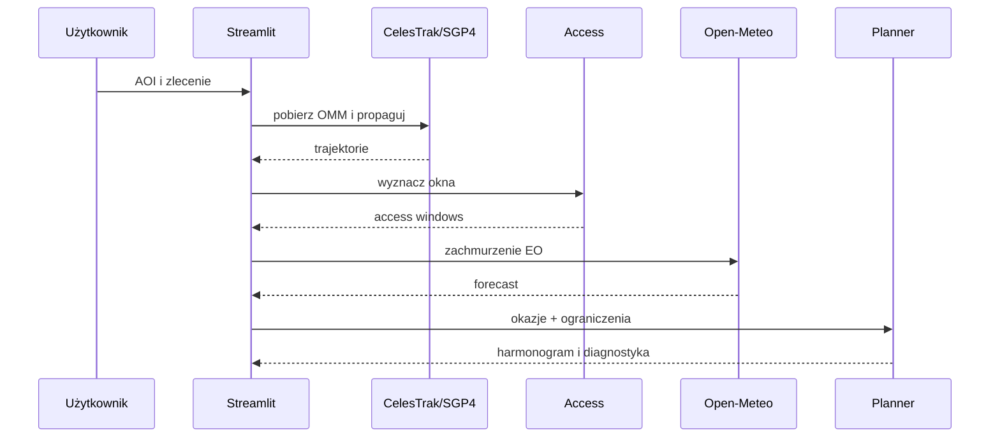

# Architektura systemu

## Warstwy

## Zasady zależności

- modele domenowe nie zależą od Streamlit,
- algorytmy planowania otrzymują komplet danych przez kontrakty usług,
- integracje zewnętrzne są izolowane w `app/integrations`,
- UI inicjuje przypadki użycia, ale nie implementuje logiki solvera,
- dane generowane trafiają do `data/generated`, a nie do katalogów wejściowych,
- raportowanie i archiwizacja operują na zwalidowanych snapshotach.

## Przepływ publiczny

## Renderowanie globusa

Aktywny renderer używa Plotly. Pliki związane z wcześniejszym prototypem Cesium
pozostają wyłącznie jako kod historyczny i nie są importowane przez bieżącą
stronę `Globus i orbity`.
