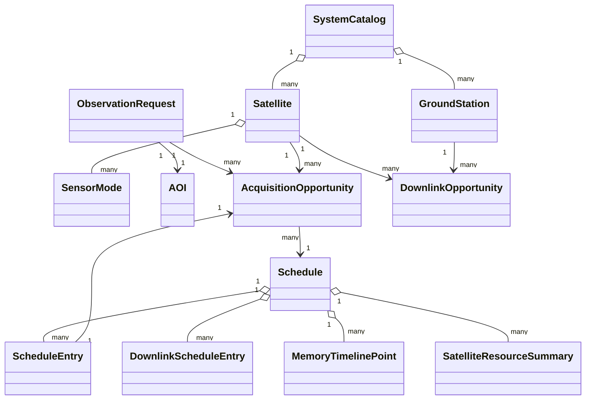

# Model danych

## Główne encje

## Zlecenie obserwacyjne

Zlecenie opisuje AOI, priorytet, przedział czasowy, wymagania SAR/EO, status
aktywności i opcjonalny limit separacji czasowej dla pary SAR–EO.

## Okazja akwizycyjna

Okazja łączy zlecenie, satelitę, tryb sensora, przedział czasu, geometrię,
jakość, pokrycie, pamięć, czas pracy, pogodę EO oraz przyczyny wykonalności lub
niewykonalności.

## Stacja naziemna i okazja downlinku

`GroundStation` przechowuje położenie, minimalną elewację, aktywność i liczbę
równoległych kanałów. `DownlinkOpportunity` opisuje stały przedział kontaktu,
szybkość łącza, sprawność oraz czasy przygotowania i zakończenia. Zbiór
`DownlinkOpportunitySet` ma własny horyzont i jest walidowany względem katalogu.

## Zasoby w harmonogramie

`DownlinkScheduleEntry` zapisuje wykorzystany kontakt, nominalną i planistyczną
pojemność oraz identyfikatory danych rozliczonych FIFO. `MemoryTimelinePoint`
rejestruje każdą zmianę pamięci. `SatelliteResourceSummary` zawiera maksimum,
stan końcowy, objętość pozyskaną i przesłaną oraz informację o kompletności
dostawy.

## Harmonogram

Harmonogram zawiera wybrane okazje, status rozwiązania, wartość funkcji celu,
konfigurację algorytmu i metryki wykonania. Historia projektu przechowuje kolejne
wersje harmonogramu wraz z różnicami.

## Identyfikatory

Identyfikatory są stabilnymi ciągami domenowymi, np. `REQ-*`, `OPP-*`,
`DLO-*`, `GS-*`, `SCHEDULE-*`, `PROJECT-*`. Import projektu waliduje duplikaty i referencje.
