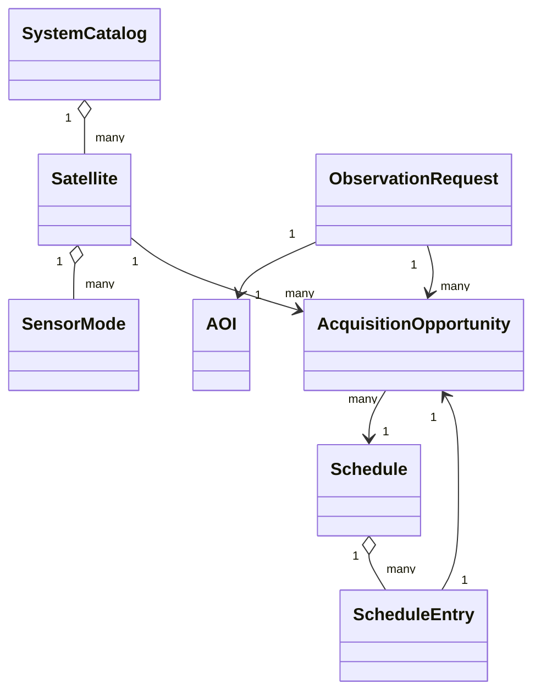

# Model danych

## Główne encje

## Zlecenie obserwacyjne

Zlecenie opisuje AOI, priorytet, przedział czasowy, wymagania SAR/EO, status
aktywności i opcjonalny limit separacji czasowej dla pary SAR–EO.

## Okazja akwizycyjna

Okazja łączy zlecenie, satelitę, tryb sensora, przedział czasu, geometrię,
jakość, pokrycie, pamięć, czas pracy, pogodę EO oraz przyczyny wykonalności lub
niewykonalności.

## Harmonogram

Harmonogram zawiera wybrane okazje, status rozwiązania, wartość funkcji celu,
konfigurację algorytmu i metryki wykonania. Historia projektu przechowuje kolejne
wersje harmonogramu wraz z różnicami.

## Identyfikatory

Identyfikatory są stabilnymi ciągami domenowymi, np. `REQ-*`, `OPP-*`,
`SCHEDULE-*`, `PROJECT-*`. Import projektu waliduje duplikaty i referencje.
