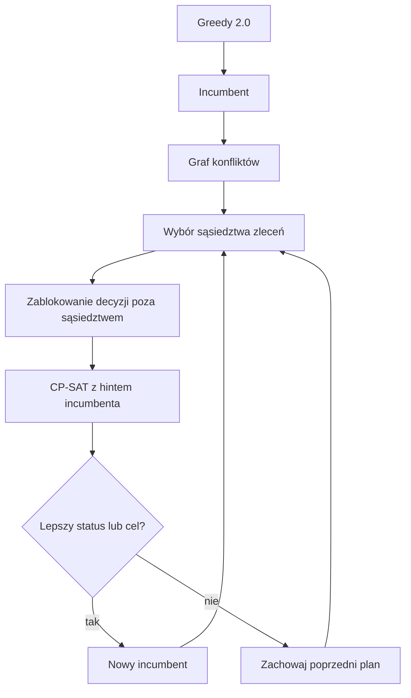
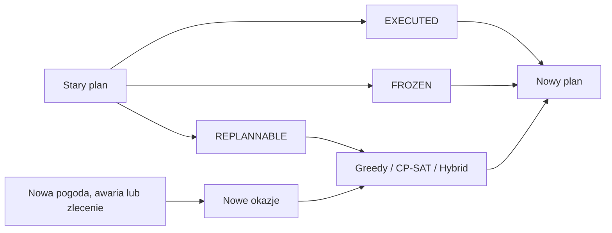

# Model planowania

## Klasyfikacja problemu

W terminologii przeglądu Wang i in. [R6] aplikacja rozwiązuje dyskretny,
wielosatelitarny wariant AEOSSP dla heterogenicznej konstelacji SAR/EO.
Kandydatem decyzyjnym jest gotowa okazja akwizycyjna zawierająca satelitę,
sensor, tryb, przedział czasu, geometrię i ocenę jakości.

Wersja 1.3.0 udostępnia trzy warianty planowania:

- **Greedy** — deterministyczna heurystyka konstrukcyjna;
- **CP-SAT** — globalny model wyboru okazji;
- **Hybrid** — Greedy 2.0 jako incumbent i lokalna poprawa CP-SAT.

Podstawa naukowa i zakres adaptacji są opisane w
[`research_foundations.md`](research_foundations.md) oraz
[`references.md`](references.md).

## Zmienna decyzyjna

Dla każdej wykonalnej okazji `i` tworzona jest zmienna binarna

\[
x_i \in \{0,1\}.
\]

Wartość `1` oznacza wybór okazji do harmonogramu. Jedno zlecenie może mieć
wiele alternatywnych okazji na różnych satelitach lub w różnych terminach.

## Wspólna funkcja celu

Greedy, CP-SAT i Hybrid korzystają ze wspólnego scoringu z
`app/planning/scoring.py`. Funkcja uwzględnia:

- priorytet zlecenia;
- premię za zlecenie obowiązkowe;
- jakość i pokrycie akwizycji;
- kompletność i zgodność par SAR–EO;
- premię za drugą akwizycję w `DUAL_OPTIONAL`;
- parametry wybranego profilu decyzyjnego.

Dla `DUAL_REQUIRED` nagroda zlecenia jest naliczana po wyborze zgodnej pary
SAR i EO. Dla `DUAL_OPTIONAL` pojedyncza akwizycja pozostaje użyteczna, a druga
otrzymuje dodatkową premię.

## Ograniczenia

Model sprawdza między innymi:

- okna czasowe i wykonalność okazji;
- brak nakładania operacji tego samego satelity;
- czas przeorientowania, obsługi sensora i stabilizacji;
- rezerwę pamięci, czas pracy i maksymalną liczbę akwizycji;
- limit akwizycji na modelowany przelot SAR;
- zmianę strony LEFT/RIGHT i kategorii trybu;
- maksymalną separację czasową par SAR–EO;
- wpisy `EXECUTED` i `FROZEN` podczas przeplanowania.

## Graf niewykonalności

`app/planning/conflict_graph.py` buduje nieskierowany graf

\[
G=(V,E),
\]

gdzie `V` jest zbiorem wykonalnych okazji, a krawędź `(i,j)` oznacza, że para
nie może zostać wybrana jednocześnie. Rejestrowane przyczyny to:

- `SAME_REQUEST_ALTERNATIVE`;
- `DUAL_PAIR_INCOMPATIBLE`;
- `SATELLITE_TRANSITION`.

Reprezentacja jest adaptacją perspektywy grafu niewykonalności Eddy’ego
[R17], [R26]. Ograniczenia globalne, takie jak dynamiczna pamięć, przepustowość downlinku
i limity kanałów stacji, nie są sprowadzane do sztucznych konfliktów parowych.

Graf służy do:

- wyznaczania kosztu konfliktowego w Greedy 2.0;
- budowy lokalnych sąsiedztw planera Hybrid;
- diagnostyki trudności scenariusza w interfejsie.

## Greedy i Greedy 2.0

Klasyczny Greedy pozostaje dostępny dla zgodności wyników historycznych. Po
włączeniu heurystyki badawczej ranking okazji ma postać:

\[
H_i = U_i + \frac{w_s}{n_i}
      - w_d d_i
      - w_m m_i
      - w_c \overline{U(N_i)},
\]

gdzie:

- `U_i` — wspólna użyteczność okazji;
- `n_i` — liczba alternatywnych okazji zlecenia;
- `d_i` — czas akwizycji;
- `m_i` — objętość danych;
- `N_i` — konfliktujące okazje innych zleceń;
- `w_s`, `w_d`, `w_m`, `w_c` — jawne współczynniki profilu.

Zlecenia z mniejszą liczbą alternatyw są rozpatrywane wcześniej. Jest to
adaptacja idei korzyści systemowej i kosztu utraconych możliwości PSB/POC
Xu i in. [R19], a nie kopia ich wzorów.

## CP-SAT

CP-SAT rozwiązuje globalny problem wyboru. Współczynniki funkcji celu i
zasobów są skalowane do liczb całkowitych zgodnie z wymaganiami OR-Tools
[R10]. Status `FEASIBLE` oznacza znalezienie planu wykonalnego, lecz nie dowód
optymalności. `OPTIMAL` oznacza dowód optymalności dla zbudowanego modelu.

Warstwa CP-SAT rozszerza model o:

- rozwiązanie początkowe przekazywane przez `AddHint`;
- możliwość ustalenia decyzji poza lokalnym sąsiedztwem;
- walidację konfliktu między wpisem stałym a decyzją zablokowaną.

## Pamięć dynamiczna i downlink

Po włączeniu `enable_downlink_planning` decyzje obrazowania są sprzężone z
oknami kontaktów. Dla satelity `s` stan pamięci w punkcie czasu `t` ma postać:

\[
M_s(t)=M_s^0+\sum_{i:e_i\le t} d_i x_i
       -\sum_{w:f_w\le t} q_w,
\]

gdzie `d_i` oznacza objętość danych akwizycji, `q_w` zaplanowaną objętość
downlinku, a `e_i` i `f_w` odpowiednio koniec akwizycji i kontaktu. W każdym
punkcie kontrolnym obowiązuje:

\[
0 \le M_s(t) \le C_s(1-r_s).
\]

Objętość transmisji w oknie jest ograniczona przez czas efektywny, szybkość
łącza, sprawność i rezerwę przepustowości:

\[
q_w \le \frac{v_w}{8}(T_w-T_{setup}-T_{teardown})\eta_w(1-r_d).
\]

Dodatkowe ograniczenia zapewniają jednocześnie:

- brak nakładających się kontaktów tej samej anteny satelity;
- nieprzekroczenie `max_simultaneous_contacts` stacji;
- opcjonalny zakaz równoczesnego obrazowania i downlinku;
- brak transmisji danych, które powstaną dopiero po rozpoczęciu kontaktu;
- opcjonalne opróżnienie pamięci do końca horyzontu.

Greedy wybiera kontakty chronologicznie i rozlicza dane FIFO. CP-SAT tworzy
zmienne całkowite objętości dla okien kontaktów i ograniczenia pamięci na osi
czasu. Hybrid przekazuje ten sam zbiór kontaktów do obu etapów. Pełny opis i
założenia znajdują się w
[`downlink_and_dynamic_memory.md`](downlink_and_dynamic_memory.md).

## Planer Hybrid

Hybrid realizuje procedurę inspirowaną połączeniem Greedy, Constraint
Programming i local search opisanym przez Antuoriego, Wojtowicza i Hebrarda
[R18]:



Kandydat pogarszający status wykonalności jest odrzucany. Poprawa statusu ma
pierwszeństwo, a przy równym statusie wymagany jest wzrost funkcji celu o co
najmniej `minimum_improvement`. Jeżeli plan początkowy Greedy 2.0 jest
wykonalny, zachodzi:

\[
F_{Hybrid} \geq F_{Greedy\ 2.0}.
\]

Nie jest to gwarancja optimum globalnego. CP-SAT optymalizuje ograniczoną grupę
zleceń, a nie cały problem od nowa w każdej iteracji.

## Profile decyzyjne

`app/planning/profiles.py` definiuje:

- `BALANCED`;
- `EMERGENCY`;
- `QUALITY_FIRST`;
- `THROUGHPUT`;
- `SAR_EO_FUSION`;
- `CUSTOM`.

Profile ustawiają jawne wagi funkcji celu i Greedy 2.0. Są uproszczoną warstwą
MCDM inspirowaną pracą Vasegaarda i in. [R21] oraz repozytorium EOS [G2]. Nie
implementują ELECTRE III, TOPSIS, progów weta ani pełnej analizy przestrzeni
wag.

## Przeplanowanie



Wpisy wykonane i zamrożone są zachowywane, a pozostała część horyzontu może
zostać ponownie zoptymalizowana. Podejście odpowiada reaktywnemu planowaniu i
trybom perturbation opisanym w [R20], [R22].

## Implementacja

```text
app/planning/config.py          konfiguracje Greedy, CP-SAT i Hybrid
app/planning/scoring.py         wspólna funkcja celu
app/planning/profiles.py        profile preferencji
app/planning/conflict_graph.py  graf niewykonalności
app/planning/fixed.py           akwizycje wykonane i zamrożone
app/planning/greedy.py          Greedy i Greedy 2.0
app/planning/cp_sat.py          globalny i lokalnie blokowany CP-SAT
app/planning/hybrid.py          iteracyjna poprawa sąsiedztw
app/planning/resources.py       pamięć na osi czasu i planowanie downlinku
app/planning/operational.py     ograniczenia operacyjne
```

Preferowany import:

```python
from app.planning import (
    DecisionProfile,
    HybridPlannerConfig,
    HybridScheduler,
    build_opportunity_conflict_graph,
)
```
