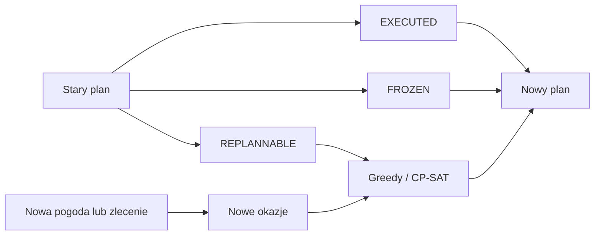

# Model planowania

## Zmienna decyzyjna

Dla każdej wykonalnej okazji `i` tworzona jest zmienna binarna `x_i`. Wartość
`1` oznacza wybór okazji do harmonogramu.

## Funkcja celu

Wspólna funkcja celu dla Greedy i CP-SAT uwzględnia:

- priorytet zlecenia;
- premię za zlecenie obowiązkowe;
- jakość i pokrycie wybranej akwizycji;
- premie za kompletne pary SAR–EO;
- opcjonalne koszty operacyjne.

Dla `DUAL_REQUIRED` nagroda zlecenia jest naliczana dopiero po wyborze zgodnej
pary SAR i EO. Dla `DUAL_OPTIONAL` druga akwizycja otrzymuje ocenę własną i
premię za uzupełnienie pary.

Logika punktacji znajduje się w `app/planning/scoring.py`, dzięki czemu oba
algorytmy korzystają z tych samych zasad.

## Ograniczenia

- brak nakładania się operacji tego samego satelity;
- czas przeorientowania i stabilizacji;
- rezerwa pamięci i limit czasu pracy sensora;
- maksymalna liczba akwizycji;
- limity na modelowany przelot ICEYE;
- zgodność stron LEFT/RIGHT i kategorii trybu;
- maksymalna separacja czasowa SAR–EO;
- operacje `EXECUTED` i `FROZEN` podczas przeplanowania.

## Implementacja

```text
app/planning/config.py    konfiguracja Greedy i CP-SAT
app/planning/scoring.py   wspólna funkcja celu
app/planning/fixed.py     akwizycje wykonane i zamrożone
app/planning/greedy.py    deterministyczna heurystyka
app/planning/cp_sat.py    model OR-Tools CP-SAT
app/planning/operational.py ograniczenia operacyjne
```

Publiczny interfejs pakietu jest dostępny przez `app.planning`.

## Greedy

Greedy sortuje kandydatów według wspólnego scoringu i kolejno dodaje okazje,
które nie naruszają ograniczeń. Dla tej samej konfiguracji wynik jest
deterministyczny.

## CP-SAT

CP-SAT rozwiązuje kombinatoryczny problem wyboru. Współczynniki funkcji celu i
zasobów są skalowane do liczb całkowitych. Po rozwiązaniu modelu wkłady są
ponownie obliczane w jednostkach zmiennoprzecinkowych do raportowania.

Limit czasu, liczba wątków i ziarno losowe są parametrami eksperymentu. Status
`FEASIBLE` nie oznacza dowodu optymalności.

## Przeplanowanie



## Zgodność importów

Preferowany import:

```python
from app.planning import CpSatPlannerConfig, GreedyPlannerConfig
```

Starsze ścieżki importu pozostają obsługiwane dla zgodności skryptów i testów.
