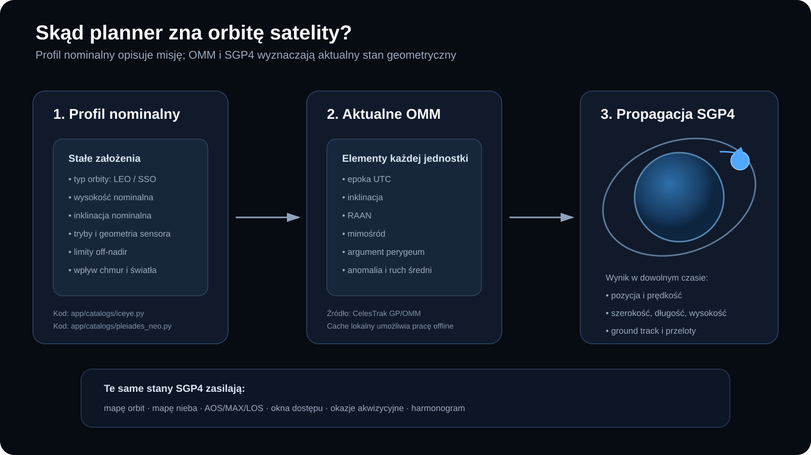
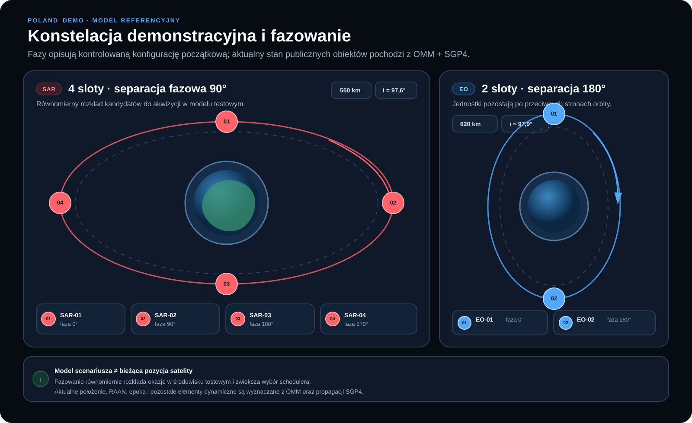
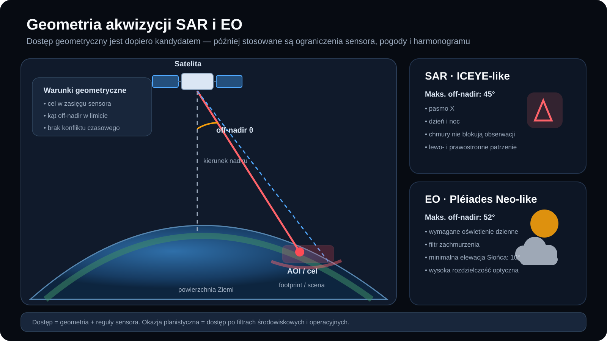
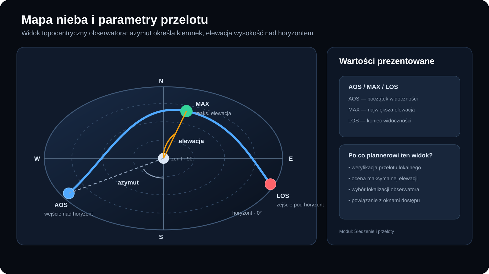
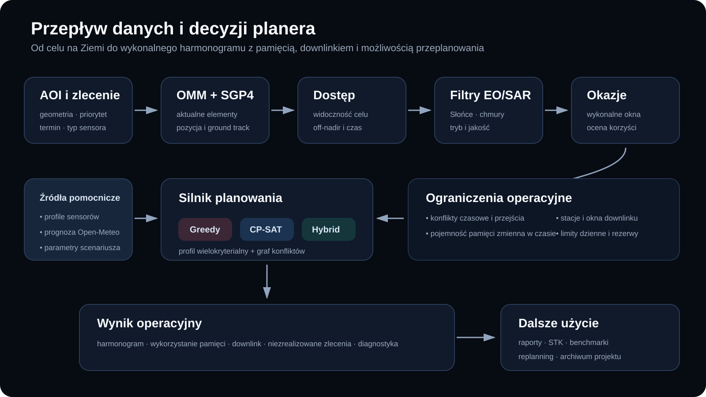

# System satelitarny, parametry i geometria

Dokument opisuje model konstelacji używany przez Satellite Acquisition Planner,
źródła parametrów, fazowanie scenariusza `POLAND_DEMO`, geometrię akwizycji oraz
przepływ danych orbitalnych do planera.

## 1. Najważniejsza zasada modelu

Projekt rozdziela dwie klasy informacji:

1. **profil nominalny misji** — stałe parametry opisujące orbitę i sensor;
2. **dynamiczny stan orbitalny** — aktualne elementy OMM propagowane przez SGP4.

Dzięki temu dokumentacja może mówić o nominalnej wysokości i inklinacji, ale
moduły śledzenia i okien dostępu nadal korzystają z bieżących elementów każdej
jednostki.

## 2. Profile publiczne

### 2.1 ICEYE-like SAR

| Parametr | Wartość w profilu |
|---|---:|
| Liczba slotów | 4 |
| Typ orbity | kołowa SSO / LEO |
| Wysokość nominalna | 570 km |
| Inklinacja nominalna | 97,7° |
| Sensor | SAR pasma X |
| Maksymalny off-nadir | 45° |
| Patrzenie | lewo i prawo |
| Światło dzienne | niewymagane |
| Wpływ zachmurzenia | brak filtra blokującego |

Wybrane tryby profilu:

| Tryb | Rozdzielczość | Scena | Kąt padania | Modelowy zakres produktu |
|---|---:|---:|---:|---:|
| Spot | 1,0 m | 5 × 5 km | 20–40° | 100–400 MB |
| Spot Fine | 0,5 m | 5 × 5 km | 20–40° | 400–1100 MB |
| Spot Extended Area | 1,0 m | 15 × 15 km | 20–40° | 1000–3000 MB |
| Dwell | 1,0 m | 5 × 5 km | 20–40° | 120–300 MB |
| Dwell Fine | 0,5 m | 5 × 5 km | 20–40° | 400–1400 MB |
| Dwell Precise | 0,25 m | 5 × 5 km | 20–33° | 2000–4000 MB |
| Strip | 3,0 m | 30 × 50 km | 15–35° | 600–1400 MB |
| Scan | 15 m | 100 × 100 km | 21–29° | 700–1300 MB |
| Scan Wide | 27 m | 200 × 300 km | 21–26° | 800–1600 MB |

Kod źródłowy profilu: [`app/catalogs/iceye.py`](../app/catalogs/iceye.py).

### 2.2 Pléiades Neo-like EO

| Parametr | Wartość w profilu |
|---|---:|
| Liczba slotów | 2 |
| Typ orbity | kołowa SSO / LEO |
| Wysokość nominalna | 620 km |
| Inklinacja nominalna | 97,9° |
| Sensor | optyczny pushbroom |
| Maksymalny off-nadir | 52° |
| Światło dzienne | wymagane |
| Minimalna elewacja Słońca | 10° — założenie modelowe |
| Domyślny limit zachmurzenia | 20% — wartość konfigurowalna |

| Produkt | Rozdzielczość | Scena | Czas modelowy |
|---|---:|---:|---:|
| Panchromatic | 0,3 m | 14 × 14 km | 5–150 s |
| Multispectral | 1,2 m | 14 × 14 km | 5–150 s |
| Pansharpened | 0,3 m | 14 × 14 km | 5–150 s |

Profil multispektralny obejmuje pasma: Deep Blue, Blue, Green, Red, Red Edge i
NIR. Kod źródłowy profilu:
[`app/catalogs/pleiades_neo.py`](../app/catalogs/pleiades_neo.py).

## 3. Profil nominalny a aktualne OMM

Nominalne wartości `570 km / 97,7°` oraz `620 km / 97,9°` służą do opisu klas
misji. Nie są używane jako stała efemeryda każdej jednostki.

Aktualne OMM dostarcza między innymi:

- epokę UTC;
- inklinację;
- RAAN;
- mimośród;
- argument perygeum;
- anomalię średnią;
- ruch średni.

Propagator SGP4 wyznacza z nich pozycję i prędkość w zadanym czasie. Wynik zasila:

- mapę orbit i ground track;
- śledzenie satelitów;
- mapę nieba oraz AOS/MAX/LOS;
- generowanie okien dostępu;
- budowę okazji akwizycyjnych;
- harmonogramowanie.

RAAN równy `0°` w szablonie profilu nie oznacza rzeczywistego RAAN satelity.
Jest to jawny placeholder zastępowany podczas pracy aktualnym rekordem OMM.

## 4. Konstelacja demonstracyjna i fazowanie

Scenariusz `POLAND_DEMO` wykorzystuje kontrolowaną konfigurację:

| Grupa | Wysokość scenariusza | Inklinacja | RAAN | Fazowanie |
|---|---:|---:|---:|---|
| SAR | 550 km | 97,6° | 10° | 0°, 90°, 180°, 270° |
| EO | 620 km | 97,9° | 25° | 0°, 180° |

Fazowanie równomiernie rozkłada sloty w modelu i zwiększa liczbę alternatywnych
okien dla planera. Nie należy interpretować go jako odtworzenia rzeczywistego
układu wszystkich komercyjnych satelitów ICEYE lub Pléiades Neo.

Strona **System i satelity** zawiera również interaktywną wersję tego schematu.
Wizualizacja:

- zachowuje separację 90° dla SAR i 180° dla EO podczas ruchu;
- pozwala wstrzymać animację i wybrać prędkość 1×, 2× lub 4×;
- podświetla wybrany slot i pokazuje fazę, wysokość, inklinację oraz RAAN
  scenariusza;
- nie korzysta z zewnętrznych bibliotek ani usług sieciowych;
- respektuje systemowe ustawienie ograniczenia animacji
  `prefers-reduced-motion`.

Źródło scenariusza:
[`data/scenarios/poland_demo/system.json`](../data/scenarios/poland_demo/system.json).

## 5. Geometria akwizycji

Podstawowe pojęcia:

- **nadir** — kierunek od satelity do punktu bezpośrednio pod platformą;
- **off-nadir** — kąt między kierunkiem nadiru i linią obserwacji celu;
- **footprint** — obszar zobrazowania na powierzchni;
- **access window** — przedział, w którym geometria umożliwia obserwację;
- **opportunity** — okno dostępu po zastosowaniu filtrów środowiskowych i
  operacyjnych.

Dla SAR dostęp nie jest blokowany przez zachmurzenie ani brak światła dziennego.
Dla EO sprawdzane są dodatkowo warunki oświetlenia i zachmurzenia.

## 6. Mapa nieba i przelot lokalny

Mapa nieba używa układu topocentrycznego obserwatora:

- azymut określa kierunek względem północy;
- elewacja określa wysokość nad horyzontem;
- **AOS** oznacza początek widoczności;
- **MAX** oznacza największą elewację;
- **LOS** oznacza koniec widoczności.

W aplikacji odpowiada za to moduł **Śledzenie i przeloty**.

## 7. Pełny przepływ planowania

Planner nie optymalizuje surowych punktów orbity. Do algorytmów trafiają okazje,
które przeszły kolejno:

1. propagację OMM/SGP4;
2. sprawdzenie geometrii celu;
3. ograniczenia sensora;
4. filtry światła i zachmurzenia EO;
5. budowę konfliktów i ocenę wielokryterialną;
6. kontrolę pamięci oraz downlinku.

Dopiero taki zbiór jest planowany przez Greedy, CP-SAT albo Hybrid.

## 8. Pochodzenie parametrów

Profile używają jawnych kategorii pochodzenia:

| Kategoria | Znaczenie |
|---|---|
| `PUBLIC_DATA` | parametr z publicznej dokumentacji |
| `MODEL_DERIVED` | jawne założenie lub wartość pomocnicza modelu |
| `PUBLIC_ORBIT_DATA` | aktualne elementy GP/OMM |
| `TLE_PENDING` | wartość oczekująca na dane orbitalne, używana w starszych przepływach |

Publiczne odniesienia są przechowywane bezpośrednio w katalogach profili.
Najważniejsze z nich to dokumentacja trybów ICEYE, strona Pléiades Neo oraz
CelesTrak GP/OMM.

## 9. Gdzie znaleźć informacje w aplikacji

- **System i satelity** — opis profili, fazowania, geometrii i przepływu danych;
- **Orbity i dane OMM** — aktualne elementy, epoka, inklinacja i propagacja;
- **Śledzenie i przeloty** — mapa nieba, ground track i AOS/MAX/LOS;
- **Okna dostępu i pogoda** — geometria sensora i filtry EO;
- **Globus operacyjny** — wspólny widok orbit, AOI, okien i harmonogramu.

## 10. Ograniczenie interpretacyjne

Projekt jest narzędziem badawczo-demonstracyjnym. Nie korzysta z prywatnej
telemetrii operatora ani z komercyjnego interfejsu taskingowego. Publiczne
profile i OMM zapewniają spójny, jawny model do eksperymentów z planowaniem,
ale nie potwierdzają rzeczywistej dostępności produktu lub wykonania akwizycji.
