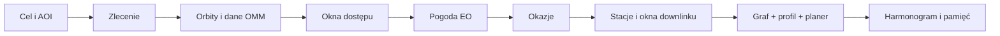

# Instrukcja użytkownika

## Typowy przepływ pracy

## 1. Cele i zlecenia

Narysuj punkt, prostokąt albo poligon. Określ priorytet, przedział czasu,
wymagany typ sensora oraz — dla zleceń podwójnych — maksymalny odstęp SAR–EO.

## 2. Orbity i dane OMM

Pobierz aktualny snapshot GP/OMM. Aplikacja przypisuje publiczne obiekty do
czterech pozycji ICEYE i dwóch pozycji Pléiades Neo oraz przechowuje cache.

## 3. Okna dostępu

Wybierz horyzont, krok propagacji i tryby sensorów. Wynik jest geometrycznym
przybliżeniem dostępu. Dla EO pobierz zachmurzenie i zbuduj okazje planistyczne.

## 4. Planowanie na danych publicznych

Wybierz Greedy, CP-SAT albo Hybrid oraz profil decyzyjny. `BALANCED` jest
punktem wyjścia, `EMERGENCY` wzmacnia zlecenia obowiązkowe,
`QUALITY_FIRST` jakość, `THROUGHPUT` przepustowość, a `SAR_EO_FUSION`
kompletność par. Ustaw rezerwę pamięci, limit solvera i ograniczenia
operacyjne. Włącz zintegrowany downlink, ustaw rezerwę przepustowości i zdecyduj,
czy wszystkie dane muszą zostać przesłane do końca horyzontu. Po planowaniu
sprawdź harmonogram, diagnostykę niezrealizowanych zleceń, graf konfliktów oraz
zakładkę **Pamięć i downlink**.

### Wyniki pamięci i downlinku

Zakładka pokazuje wpisy kontaktów, objętość przesłaną, szczyt i stan końcowy
pamięci każdego satelity oraz wykres osi czasu. Kontakty w scenariuszach
referencyjnych są syntetyczne i nie zastępują obliczeń dostępu radiowego.

## 5. Przeplanowanie na danych publicznych

Wybierz moment przeplanowania i długość okna zamrożonego. Aplikacja zachowa
operacje bliskoterminowe, odświeży pogodę EO i zoptymalizuje pozostały horyzont.

## 6. Globus operacyjny

Globus Plotly pokazuje ground tracki, bieżące pozycje satelitów, AOI, okna
dostępu i zaplanowane połączenia. Widok 3D przedstawia orbity przestrzenne.

## 7. Walidacja STK

Pobierz paczkę przypadku, odtwórz go w STK, wyeksportuj Access lub AER i
zaimportuj raport. Porównaj błędy granic okien i geometrii.

## 8. Benchmarki

Uruchom serię scenariuszy o rosnącej liczbie zleceń. Eksportuj surowe przebiegi,
podsumowania i wykresy porównujące Greedy, CP-SAT i Hybrid.

## 9. Projekty

Zapisz całą sesję jako `.satplan.zip`. Import jest poprzedzony kontrolą manifestu,
sum SHA-256, wersji schematu i referencji między obiektami.

## 10. Raporty

Wygeneruj pakiet HTML, DOCX, XLSX, JSON, CSV i PNG. Zakres raportu zależy od
tego, które komponenty zostały wcześniej wyliczone w bieżącej sesji.
